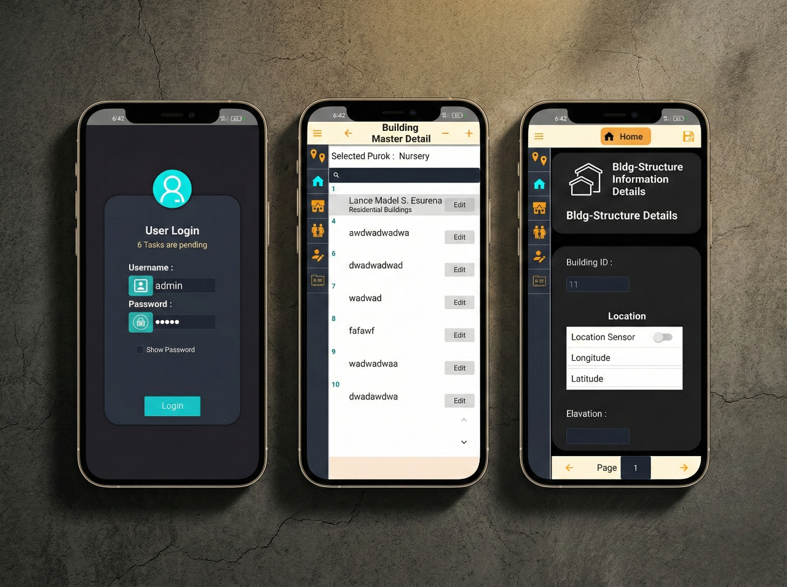
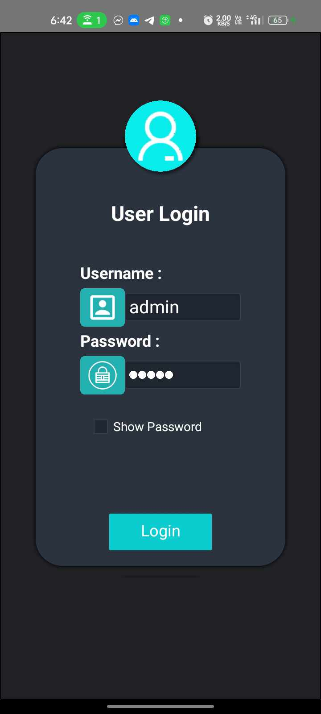
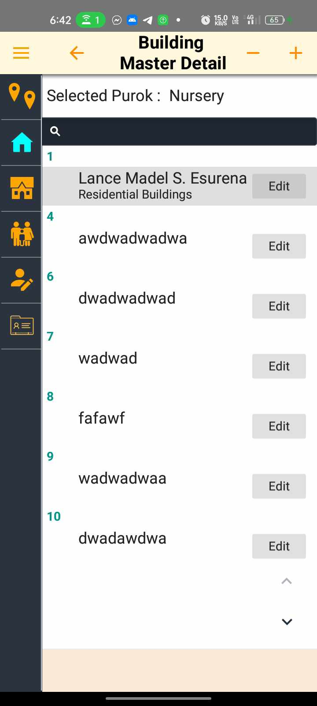
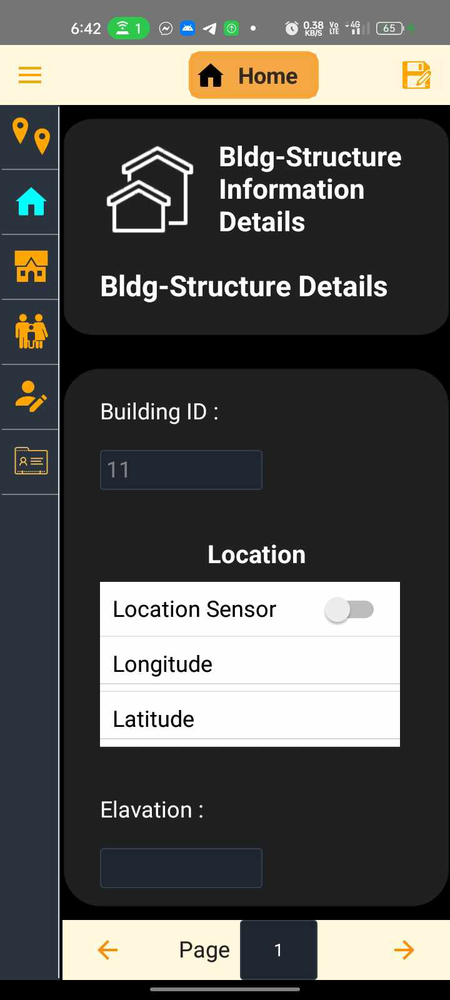

<div align="center">

  <h1>📱 DataXpress Mobile</h1>
  <h3>Cross-Platform Data Management & Export Utility</h3>

  <p>
    A high-performance mobile utility built with <b>Delphi FMX</b> designed for <br />
    seamless data entry, local storage management, and flexible data exporting.
  </p>

  <p>
    
    
    
    
  </p>

  

</div>

<br />

## 📖 Overview

**DataXpress** is a versatile mobile application engineered using the **FireMonkey (FMX)** framework. It serves as a portable data hub, allowing users to capture information on the go and manage it within a secure local environment. 

The app leverages **SQLite** for robust local persistence and features a modern, fluid user interface. Whether you are conducting field audits, managing personal inventories, or tracking rapid data entries, DataXpress provides the tools to organize your data and export it for further analysis.

---

## 🎯 Key Features

| Feature | Description |
| :--- | :--- |
| **⚡ Rapid Entry** | Optimized input forms designed for fast mobile data capture with minimal taps. |
| **🗄️ Local Persistence** | Secure, offline-first storage using a high-performance **SQLite** backend. |
| **📊 Data Grid View** | Interactive data viewing with sorting and filtering capabilities for easy record management. |
| **📤 Flexible Export** | Export your locally stored data into standard formats (CSV/JSON) for external use. |
| **🎨 Modern UI** | Built with FMX and Skia to ensure a smooth, native-like experience on both Android and iOS. |
| **🔍 Smart Search** | Quickly locate specific records within your local database using an integrated search engine. |

---

## 🛠️ Technical Stack

* **Language:** Object Pascal (Delphi)
* **Framework:** FireMonkey (FMX)
* **Database Access:** FireDAC
* **Database Engine:** SQLite (Embedded)
* **Graphics:** Skia4Delphi (for enhanced UI rendering and performance)
* **Deployment:** Android (APK/AAB) and iOS (IPA)

---

## 📸 App Gallery

<table>
  <tr>
    <td align="center">
      <h3>Login Form</h3>
      
    </td>
    <td align="center">
      <h3>Purok Master Details</h3>
      
    </td>
    <td align="center">
      <h3>Data Entry</h3>
      
    </td>
  </tr>
</table>

---

## 🚀 Getting Started

### Prerequisites
* **Embarcadero Delphi 11/12 (Alexandria/Athens)**
* **Android SDK/NDK** (for Android builds)
* **macOS/Xcode with PAServer** (for iOS builds)

### Installation
1.  **Clone the repository:**
    ```bash
    git clone [https://github.com/Lance0567/DataExpress.git](https://github.com/Lance0567/DataExpress.git)
    ```
2.  **Open Project:**
    Load `DataXpress.dproj` in the Delphi IDE.
3.  **Configure Target:**
    Select your target platform (Android 64-bit or iOS Device).
4.  **Build and Run:**
    Press `F9` to compile and deploy to your connected device.

---

<div align="center">
  <p>Developed by <b>Lance Esureña</b></p>
  <p>
    <a href="https://www.linkedin.com/in/lance-madel-esure%C3%B1a-ba4871282/">
      
    </a>
    <a href="https://lance-portfolio.vercel.app/">
      
    </a>
  </p>
</div>
